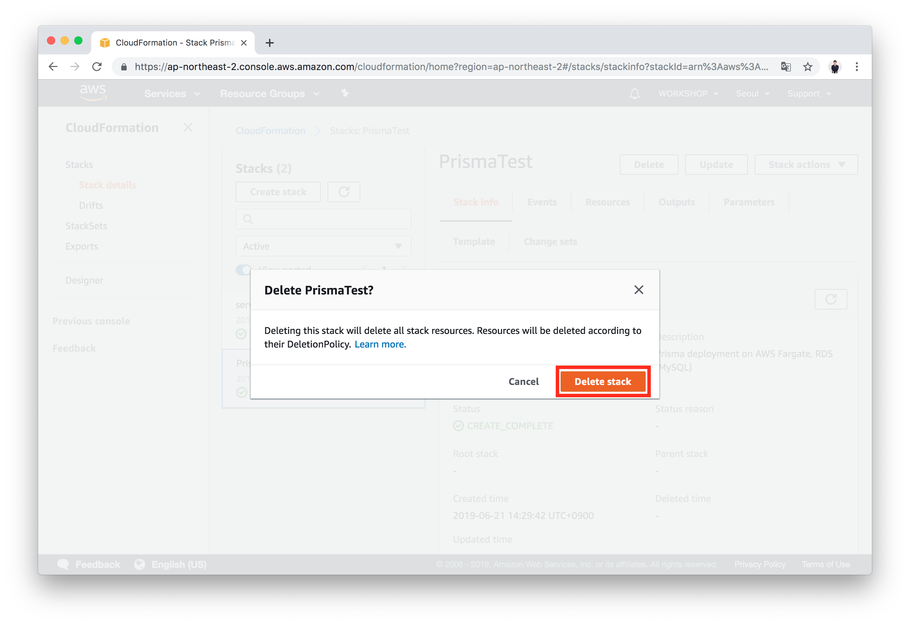
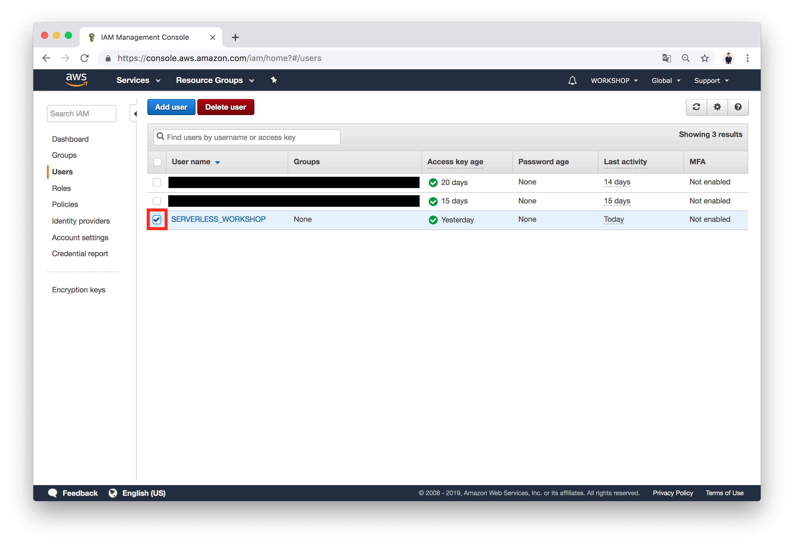

# 6. 삭제하기

## (1) API 배포 삭제하기
- `/starters/server/` 폴더로 이동합니다.

  ```bash
  $ cd ./starters/server
  ```

- 다음 스크립트를 CLI에 입력합니다.

  ```bash
  $ yarn undeploy:dev
  ```

## (2) CloudFormation Stack 삭제하기
- [AWS Console](https://console.aws.amazon.com)에 로그인 후 `Find Services`에서 `CloudFormation`을 검색, 클릭합니다.
  

- 챕터 3에서 생성한 CloudFormation 스택을 선택 한 뒤 `DELETE` 버튼을 클릭합니다.
  

- `Delete stack`을 클릭합니다.
  

## (3) IAM 사용자 삭제하기
- [AWS Console](https://console.aws.amazon.com)에 로그인 후 `Find Services`에서 `IAM`을 검색, 클릭합니다.
  

- `Users` 메뉴로 이동합니다
  

- 전에 생성한 `SERVERLESS_WORKSHOP`을 선택 한 뒤, `Delete user`를 클릭합니다.
  

- `One or more...`를 선택 한 뒤, `Yes, delete`를 클릭합니다.
  


## 다음으로 이동
1. **GraphQL 살펴보기** ✔
    1. GraphQL이란?
    2. GraphQL Type 시스템과 `Query`, `Mutation` Type
    3. Nexus로 시작하는 *Code-First* GraphQL 개발
    4. GraphQL Playground
    5. `Task` 타입과 쿼리, 뮤테이션 만들기
2. **Serverless로 GraphQL API 배포하기** ✔
    1. IAM 사용자 생성하기
    2. Serverless Framework을 사용해 Node.js 프로젝트 배포하기
3. **AWS에 Prisma 배포하기 (CloudFormation)** ✔
4. **Prisma 사용하기** ✔
    1. Prisma란?
    2. Prisma 시작하기
    3. Prisma Client 사용해보기
    4. `nexus-prisma`를 사용해, Prisma 연결하기
5. **React.js에서 GraphQL API 사용하기** ✔
6. **삭제하기** ✔
    1. API 배포 삭제하기
    2. CloudFormation Stack 삭제하기
    3. IAM 사용자 삭제하기
0. **[처음으로 돌아가기](/)**
